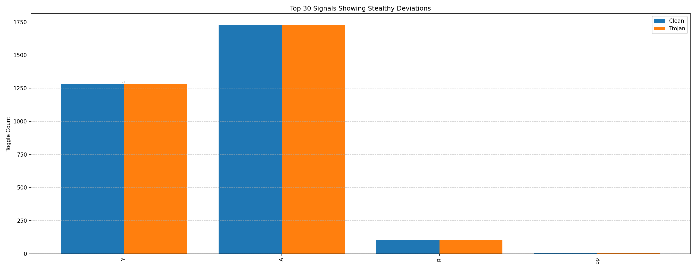

# Hardware Trojan Detection using Side-Channel Analysis  
**Project:** D4 – Hardware Trojan Detection Challenge 
**Author:** Rammohan M 
**Toolchain:** Vivado 2025.1 + Python 3 
**Date:** November 2025 

---

## Overview  
This project demonstrates the detection of a **stealthy hardware Trojan** inside a 4-bit ALU using **side-channel toggle analysis**. 
While both ALUs (Clean and Trojan) produce nearly identical logical outputs, **tiny deviations in switching activity** reveal the presence of hidden malicious logic.

---

## Objective  
To design, simulate, and analyze a 4-bit Arithmetic Logic Unit (ALU) that contains a stealthy Trojan which only activates under a rare input condition. 
Detection is achieved by monitoring **output mismatches** and **side-channel toggle variations** in the generated waveform.

---

## Design Summary  

| Component | Description |
|------------|-------------|
| **Clean ALU** | Performs standard 4-bit operations (ADD, SUB, AND, OR) |
| **Trojan ALU** | Functionally identical, but adds hidden XOR logic that activates only when `A=1111`, `B=1111`, `op=00` |
| **Testbench (`tb_alu.v`)** | Applies exhaustive test vectors to both ALUs in parallel |
| **Python Analysis** | Detects both functional and side-channel differences through waveform and toggle analysis |

---

## Trojan Trigger Condition  
```verilog
if (A == 4'b1111 && B == 4'b1111 && op == 2'b00)
    Y_trojan = Y_clean ^ 4'b0001;  // Flips LSB stealthily
```
This Trojan is **rarely triggered** — it activates only once in the entire 1024-input test sweep.

---

## Simulation Details  
- **Tool:** Vivado Simulator 
- **Waveform File:** `simulation/alu_both.vcd` 
- **GTKWave Config:** `simulation/alu_both.gtkw` 
- **Python Analysis Scripts:**
  - `analysis/trojan_compare_single.py`
  - `analysis/toggle_analyzer.py`

---

## Results  

### 1) Functional Mismatch Detection  
(File: `analysis/deviation_report_single.txt`) 
```
=== Hardware Trojan Detection Report (Single VCD) ===
Total time points analyzed: 5138
Mismatches detected: 5

 Time (ns)    Y_clean   Y_trojan
----------------------------------------
   1276000       1110       1111
   1277000       1110       1111
   1278000       1110       1111
   1279000       1110       1111
   1280000       1110       1111
```
 The Trojan activated exactly once (around **1.276 µs**), flipping one output bit — confirming stealthy malicious logic.

---

### Side-Channel Toggle Analysis  
(File: `analysis/toggle_analysis.png`)

Even though total toggle counts were **almost identical**:
```
Total Toggles (Clean ALU):   3121
Total Toggles (Trojan ALU):  3120
Switching Activity Deviation: -1 toggles (-0.03%)
```
the enhanced analyzer detected a **subtle deviation** — just **one toggle difference** in the Trojan design.

This seemingly negligible mismatch is visible in the toggle deviation chart below:

**Top 30 Signals Showing Stealthy Deviations**


This single-toggle anomaly confirms that even an *extremely stealthy Trojan* slightly perturbs the switching activity — validating the sensitivity of the detection approach.

---

###  Waveform Verification  
(File: `docs/waveform_screenshots.png`) 
Captured directly from Vivado, showing the Trojan trigger at 1.275 µs:

| Signal | Value |
|---------|--------|
| A | 1111 |
| B | 1111 |
| op | 00 |
| Y_clean | 1110 (14) |
| Y_trojan | 1111 (15) |

The waveform confirms both **functional activation** and **side-channel disturbance** occurred exactly under the Trojan’s rare condition.

---

## Summary of Detection

| Observation | Interpretation |
|--------------|----------------|
| 5 logical mismatches | Functional Trojan activation confirmed |
| 1 toggle deviation | Stealthy side-channel signature detected |
| No extra toggles elsewhere | Trojan remained dormant otherwise |
| Identical outputs under all other cases | Confirms design stealth |
| Python analysis confirmation | Automated detection achieved successfully |

---

## Conclusion  
This experiment successfully demonstrates a **complete hardware Trojan detection flow**:
1. Functional-level verification through waveform comparison. 
2. Side-channel level analysis using toggle-based activity metrics. 
3. Visualization and identification of even the smallest deviations.

> **Even a single toggle difference can expose a stealth Trojan.**

The analysis confirms that the Trojan, though extremely stealthy, was **successfully detected both functionally and through side-channel signatures.**

---

## Final Project Structure  
```
D4-Hardware-Trojan/
│
├── src/
│   ├── alu_clean.v
│   ├── alu_trojan.v
│   └── tb_alu.v
│
├── simulation/
│   ├── alu_both.vcd
│   ├── alu_both.gtkw
│
├── analysis/
│   ├── trojan_compare_single.py
│   ├── toggle_analyzer.py
│   ├── deviation_report_single.txt
│   ├── toggle_analysis.png
│   └── waveform_compare.png
│
├── schematic/
│   ├── alu_clean_schematic.pdf
│   └── alu_trojan_schematic.pdf
│
└── docs/
    ├── README.md
    └── waveform_screenshots.png
```
